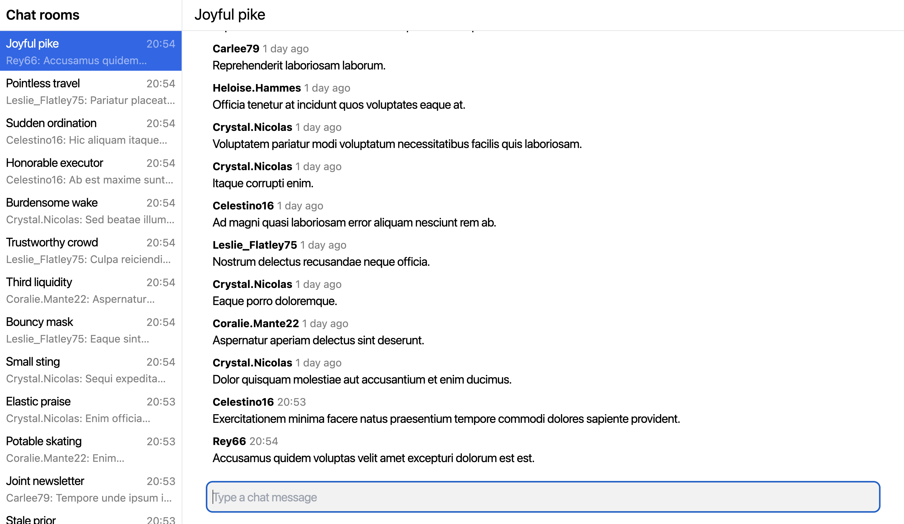

# Method

In brief, my method can be broken into two parts of which each part can
further be broken into steps:

1.  Research

    a. Find related work.

    b. Review related work.

    c. Assess related work.

2.  Implementation

    a. Develop an example application which demonstrates the problem.

    b. Develop the solution to the problem in the example application.

    c. Extract the solution from the example application into a
    library.

## Research

I explore related work to gain a greater insight into potential ways of
solving the problem and to find pre-existing solutions to potentially
draw from, use in, integrate into, or embed into my solution.

### Finding related work

I search for related work with the initial search terms:

-   "cloud firestore client-side sdk features but open-source and not
    google"

-   "open-source, non-google solutions for listening to queries like in
    cloud firestore client-side sdk"

### Comparing related work

I compare related work based on the following items:

-   Modularity

    -   **<a id="full-stack" href="#full-stack" style={{scrollMarginTop: "calc(var(--ifm-navbar-height) + 0.5rem)"}}>Full stack</a>** 
        The solution is full stack, meaning it comes with both a
        server-side component and a client-side component.

    -   **<a id="backend-agnostic" href="#backend-agnostic" style={{scrollMarginTop: "calc(var(--ifm-navbar-height) + 0.5rem)"}}>Backend-agnostic</a>** 
        The solution is backend-agnostic, meaning it can be used with
        any kind of backend.

    -   **<a id="modular" href="#modular" style={{scrollMarginTop: "calc(var(--ifm-navbar-height) + 0.5rem)"}}>Modular</a>** 
        The solution is modular, meaning it can be incrementally adopted
        or used in a partial manner. The solution is shipped more like a
        toolkit where you can pick and use the tools you like and
        discard the rest and less like a solution that you either must
        buy into entirely or not use at all.

-   Developer experience

    -   **<a id="1st-class-typescript-support" href="#1st-class-typescript-support" style={{scrollMarginTop: "calc(var(--ifm-navbar-height) + 0.5rem)"}}>1st-class TypeScript support</a>** 
        The solution is written in
        [TypeScript](https://www.typescriptlang.org/) and it ships with
        detailed type definitions.

    -   **<a id="graphical-developer-tools" href="#graphical-developer-tools" style={{scrollMarginTop: "calc(var(--ifm-navbar-height) + 0.5rem)"}}>Graphical developer tools</a>** 
        There are official graphical developer tools to be used with the
        solution.

-   UI framework integrations

    -   **<a id="1st-class-react-support" href="#1st-class-react-support" style={{scrollMarginTop: "calc(var(--ifm-navbar-height) + 0.5rem)"}}>1st-class React support</a>** 
        There solution has an official [React.js](https://react.dev/)
        adapter.

    -   **<a id="1st-class-solid-support" href="#1st-class-solid-support" style={{scrollMarginTop: "calc(var(--ifm-navbar-height) + 0.5rem)"}}>1st-class Solid support</a>** 
        The solution has an official [SolidJS](https://www.solidjs.com/)
        adapter.

    -   **<a id="1st-class-vue-support" href="#1st-class-vue-support" style={{scrollMarginTop: "calc(var(--ifm-navbar-height) + 0.5rem)"}}>1st-class Vue support</a>** 
        The solution has an official [Vue.js](https://vuejs.org/)
        adapter.

    -   **<a id="1st-class-svelte-support" href="#1st-class-svelte-support" style={{scrollMarginTop: "calc(var(--ifm-navbar-height) + 0.5rem)"}}>1st-class Svelte support</a>** d
        The solution has an official [Svelte](https://svelte.dev/)
        adapter.

-   ORM (Object-Relation Mapping) capabilities

    -   **<a id="relationship-tracking" href="#relationship-tracking" style={{scrollMarginTop: "calc(var(--ifm-navbar-height) + 0.5rem)"}}>Relationship tracking</a>** 
        The solution "understands" relationships in your data.

    -   **<a id="live-queries" href="#live-queries" style={{scrollMarginTop: "calc(var(--ifm-navbar-height) + 0.5rem)"}}>Live queries</a>** 
        The solution provides a mechanism to listen for when the result
        of a query for data changes.

-   Consideration of asynchronicity and concurrency

    -   **<a id="optimistic-updates" href="#optimistic-updates" style={{scrollMarginTop: "calc(var(--ifm-navbar-height) + 0.5rem)"}}>Optimistic updates</a>** 
        The solution provides a dedicated mechanism for optimistic
        updates and the use-case of optimistic updates was taken into
        consideration in the design of the solution.

    -   **<a id="browser-tab-sync" href="#browser-tab-sync" style={{scrollMarginTop: "calc(var(--ifm-navbar-height) + 0.5rem)"}}>Browser tab sync</a>** 
        The solution provides a way to synchronize the state between
        browser tabs.

-   Offline support

    -   **<a id="offline-first" href="#offline-first" style={{scrollMarginTop: "calc(var(--ifm-navbar-height) + 0.5rem)"}}>Offline-first</a>** 
        The solution embraces the offline-first use-case and can be used
        to power offline-first web experiences.

    -   **<a id="data-persistence" href="#data-persistence" style={{scrollMarginTop: "calc(var(--ifm-navbar-height) + 0.5rem)"}}>Data persistence</a>** 
        The solution provides a mechanism to persist data.

    -   **<a id="create-when-offline-publish-when-online" href="#create-when-offline-publish-when-online" style={{scrollMarginTop: "calc(var(--ifm-navbar-height) + 0.5rem)"}}>Create when offline, publish when online</a>** 
        The solution provides a mechanism to create data when offline,
        persist it locally, and publish it to any potential remote data
        source once the client's network is reconnected (the remote data
        source becomes available again).

[TanStack Query](https://tanstack.com/query) and the [Cloud
Firestore](https://firebase.google.com/docs/firestore) client-side SDK
are included in the comparison for the sake of reference.

The items are a union of key features of the solutions being compared.

The purpose of the comparison is to map out where each solution
predominantly exists in the problem space and how much territory it
covers.

### Assessing related work

I decide on how to proceed with my solution which can take care of the
query cache updating in a generic and robust way.

I assess if and to what degree related work can be utilized in my
solution. I want to avoid reinventing the wheel, so, if possible, my
solution should be an integration of pre-existing solution and not an
entirely new solution.

## Implementation

I first solve the problem in an example application which uses [TanStack
Query](https://tanstack.com/query). I then extract the solution into a
separate library.

### Developing an example application

I develop an example application which uses [TanStack
Query](https://tanstack.com/query), and which acts as a sandbox for
developing the solution to the problem as well as a practical example of
the problem, prior to the solution being developed in it.

The application should resemble a typical chat application, the likes of

-   [Slack](https://slack.com/),

-   [Discord](https://discord.com/),

-   [Telegram](https://telegram.org/),

-   or [WhatsApp](https://whatsapp.com/).

The UI is expected to look like this:

_<small>Figure 1. Example chat application UI</small>_

On the left-hand side, you have a list of chat rooms. On the right-hand
side, you have a list of messages in the currently selected chat room.

#### Detailed requirements

-   It should be able to fetch and display a list of chat rooms.

    -   Ordered by when the latest chat message was sent, descending.

    -   A preview of the latest chat message should be displayed in the
        chat room list item.

    -   The list should be an "infinite scroll" list, meaning it should
        load more chat rooms as the user scrolls down.

-   It should let the user select a chat room to view the messages in
    that room and send new messages to that room.

-   It should be able to fetch and display a list of chat messages in
    the currently selected chat room.

    -   Ordered by when the chat message was sent, descending.

    -   The list should be an "infinite scroll" list, meaning it should
        load more chat messages as the user scrolls to the end of the
        list.

-   It should let the user send a new chat message to the currently
    selected room.

-   It should automatically and as quickly as possible update the UI to
    reflect changes to the data when new chat messages arrive or when
    the user has sent a new chat message.

### Solving the problem

I solve the problem in the example application.

This method was chosen due to its agile attributes. Carving out the
solution this way benefits from quick iteration and a tight feedback
loop and you stay close to reality as your development server provides
you with real-time feedback on whether your solution works in practice
or not and whether it actually solves the problem or not.

### Packaging the solution as a library

I extract the solution from the example application into a separate
library, and package it in a way which allows it to be consumed and used
in any application that uses [TanStack
Query](https://tanstack.com/query), with minimal additional
configuration.
