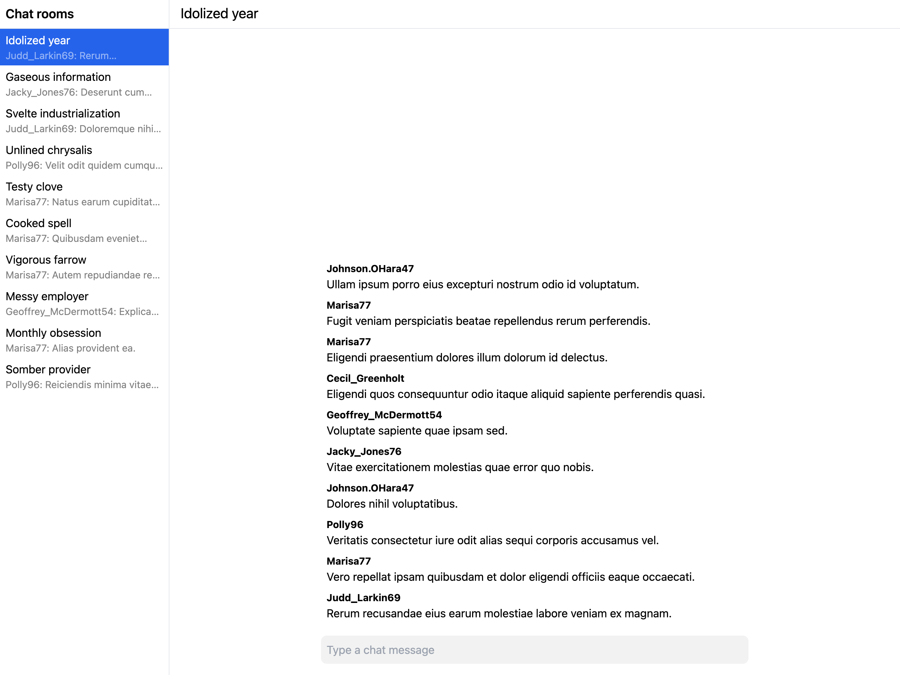

# When React Query falls short

I could start explaining how I think the [React Query][rq] pattern falls short, using fancy terms like

-   "scalability",
-   "code ergonomics",
-   and "maintainability"

but I think it's better if I instead, right off the bath, give a concrete example.

## A concrete example

Imagine, you're building a typical (current age) chat application. An application like

-   [Slack](https://slack.com/),
-   [Discord](https://discord.com/),
-   [Telegram](https://telegram.org/),
-   or [WhatsApp](https://whatsapp.com/).

The UI is expected to look something like this:



On the left-hand side, you have a list of chat rooms. On the right-hand side, you have a list of messages in the currently selected chat room.

Now, imagine that you're building the UI for this application using the [React Query][rq] pattern.

You would probably start out by creating an `App` component that looks something like this:

```tsx title="src/App.tsx"
export const App = () => {
    const [
        selectedChatRoomId,
        setSelectedChatRoomId,
    ] = useState<string | null>(null);
    return (
        <div>
            <ChatRoomList
                selectedChatRoomId={selectedChatRoomId}
                setSelectedChatRoomId={setSelectedChatRoomId}
            />
            <ChatRoom chatRoomId={selectedChatRoomId} />
        <div/>
    );
};
```

:::note

For the sake of brevity, only the most relevant source code for this example is shown. For the full source code, see the [GitHub repository](https://github.com/DanielGiljam/offline-full-text-search-in-web-app/tree/main/apps/typical-chat-app-with-react-query).

:::

Then you would go on to implement the `ChatRoomList` component…

```tsx title="src/ChatRoomList.tsx"
const queryFn = async () => {
    const response = await fetch("/api/chat-rooms");
    return response.json();
};

export const ChatRoomList = ({
    selectedChatRoomId,
    setSelectedChatRoomId
}: ChatRoomListProps) => {
    const {data: chatRooms} = useQuery({
        queryKey: ["chat-rooms"],
        queryFn,
    });
    return (
        <ul>
            {chatRooms?.map((chatRoom) => (
                // Assumed stateless component,
                // implementation not of interest in this example
                <ChatRoomListItem
                    key={chatRoom.id}
                    chatRoom={chatRoom}
                    selected={chatRoom.id === selectedChatRoomId}
                    onClick={() => setSelectedChatRoomId(chatRoom.id)}
                />
            ))}
        <ul/>
    );
};
```

…and the `ChatRoom` component.

```tsx title="src/ChatRoom.tsx"
export const ChatRoom = ({chatRoomId}: ChatRoomProps) => {
    return (
        <div>
            <ChatMessageList chatRoomId={chatRoomId} />
            <ChatMessageInput chatRoomId={chatRoomId} />
        <div/>
    );
};
```

Now, we have two more components to implement.

The `ChatMessageList` component…

```tsx title="src/ChatMessageList.tsx"
const queryFn = async (ctx: QueryFunctionContext<["chat-messages", string]>) => {
    const response = await fetch(`/api/chat-room/${ctx.queryKey[1]}/chat-messages`);
    return response.json();
};

export const ChatMessageList = ({chatRoomId}: ChatMessageListProps) => {
    const {data: chatMessages} = useQuery({
        queryKey: ["chat-messages", chatRoomId],
        queryFn,
    });
    return (
        <ul>
            {chatMessages?.map((chatMessage) => (
                // Assumed stateless component,
                // implementation not of interest in this example
                <ChatMessageListItem
                    key={chatMessage.id}
                    chatMessage={chatMessage}
                />
            ))}
        <ul/>
    );
};
```

…and the `ChatMessageInput` component.

```tsx title="src/ChatMessageInput.tsx"
const mutationFn = async ({
    chatRoomId,
    text,
}: {
    chatRoomId: string;
    text: string;
}) => {
    const response = await fetch(`/api/chat-room/${chatRoomId}/chat-message`, {
        method: "POST",
        headers: {
            "Content-Type": "application/json",
        },
        body: JSON.stringify({text}),
    });
    return response.json();
};

export const ChatMessageInput = ({chatRoomId}: ChatMessageInputProps) => {
    const [text, setText] = useState("");
    const {mutate: sendChatMessage, isLoading} = useMutation({
        mutationFn,
        onSuccess: () => setText(""),
    });
    const onChange = (event: React.ChangeEvent<HTMLInputElement>) => {
        setText(event.target.value);
    };
    const onKeyDown = (event: React.KeyboardEvent<HTMLInputElement>) => {
        if (event.key === "Enter") {
            sendChatMessage({chatRoomId, text});
        }
    };
    return (
        <input
            value={text}
            disabled={isLoading}
            onChange={onChange}
            onKeyDown={onKeyDown}
        />
    );
};
```

[rq]: /#the-react-query-pattern
